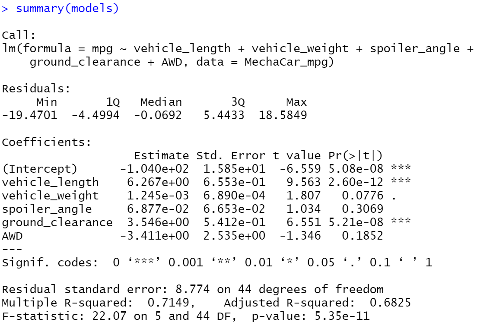
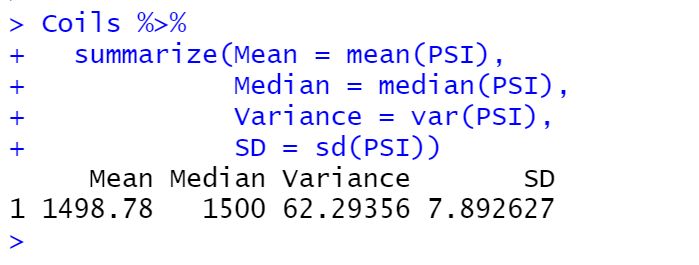
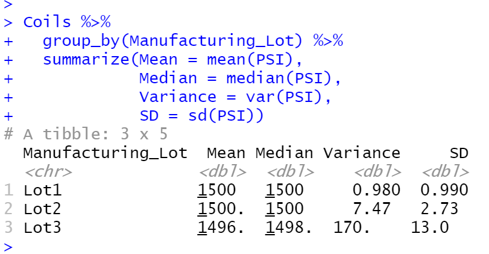
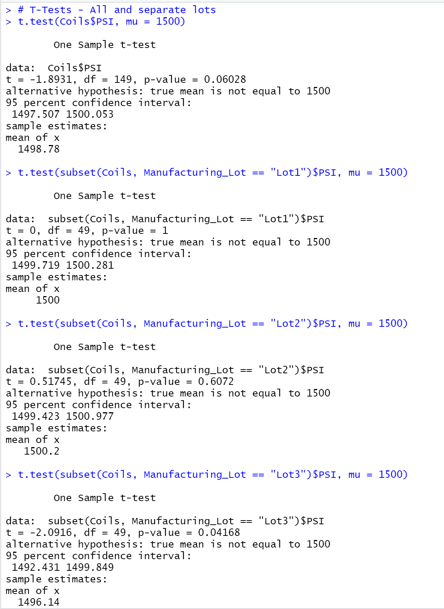

# README

# Module 15 - MechaCar Statistical Analysis Challenge

## Linear Regression to Predict MPG

1. Which variables/coefficients provided a non-random amount of variance to the mpg values in the dataset?

Variables vehicle length and ground clearance provided a non-random amount of variance. The high p-value indicated a high significance of other factors contributing to the variance.

2. Is the slope of the linear model considered to be zero? Why or why not?

The slope is not considered zero. A near zero slope means that some of the independent variables have an impact on the dependent variable.

3. Does this linear model predict mpg of MechaCar prototypes effectively? Why or why not?

The R-squared value of 0.7149 indicates 71% of the instances would approximated predict the correct mpg.

## Summary Statistics on Suspension

The design specifications for the MechaCar suspension coils dictate that the variance of the suspension coils must not exceed 100 pounds per square inch. Does the current manufacturing data meet this design specification for all manufacturing lots in total and each lot individually? Why or why not?

In the Coils-Summary.png, the variance is 62.29356 which meets the 100 pounds per sqare inch limit. The Coils-Summary-GroupBy.png breaks down each lot. All three lots combined exceed the limit since the variance for Lot3 is by itself 170. and over the limit. Individually Lot1 at 0.980 and Lot2 at 7.47 meet the limit. Combining Lot1 and Lot2 would also be under the limit.

## T-Tests on Suspension Coils

Summarize interpretation and findings for the T-test results.

Combined and individual lots t-values are all above the significance of 0.05. Lot 3 is has the lowest t-value and p-value probability of happening by chance is log being so close to the 0.05 significance. 

All Lots t-value = 1.8931, p-value
Lot 1 t-value = 0, p-value = 1
Lot 2 t-value = 0.51745, p-value = 0.6072 
Lot 3 t-value = -2.0916, p-value = 0.04168

# Study Design: MechaCar vs Competition

A statistical study of how MechaCar performs against the competition for city or highway fuel efficiency. With the ever fluctuating (especially increased) gas prices, consumers would be interested. 

The Null Hypothesis is that all the cars in the same class have the same fuel efficiency with the Alternate Hypothesis being the opposite. To test the hypothesis execute a t-test or Anova test to show statistical differences between cars. For a visualization, use a plot (box) to show the spread. The data needed would be a sample of at least 50-100 cars to generate a sample size for each class type.
